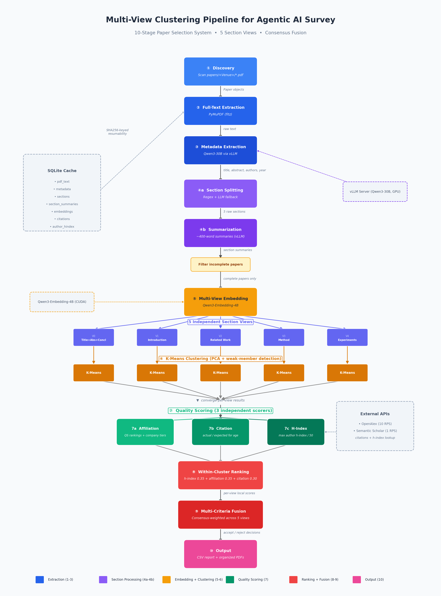

<div align="center">

# AI Survey Paper Selection Pipeline

**Automated multi-view clustering pipeline for academic paper selection**

[](https://www.python.org/downloads/)

<br/>



<sub><a href="docs/pipeline_diagram.pdf">View high-resolution PDF</a></sub>

</div>

<br/>

## Prerequisites

| Requirement | Details |
|:------------|:--------|
| **Python** | 3.10+ |
| **GPU** | CUDA-capable with drivers installed |
| **vLLM** | Installed separately (requires matching CUDA version) |
| **Internet** | For OpenAlex / Semantic Scholar APIs and HuggingFace model downloads |

## Setup

### 1. Install dependencies

```bash
python3 -m venv venv
source venv/bin/activate
pip install -r requirements.txt
pip install vllm
```

### 2. Prepare input data

Place PDFs in `papers/`, organized by venue subfolders. The folder name becomes the venue label:

```
papers/
├── NeurIPS/
│   ├── paper1.pdf
│   └── paper2.pdf
├── ICLR/
│   └── paper3.pdf
└── arXiv/
    └── paper4.pdf
```

### 3. Start vLLM server

```bash
bash scripts/start_vllm_server.sh
```

Serves **Qwen/Qwen3-30B-A3B-Instruct-2507-FP8** (MoE, 30.5B params / 3.3B active, FP8) with tensor parallelism across 2 GPUs. Override defaults with environment variables:

```bash
VLLM_TP_SIZE=1 VLLM_MAX_MODEL_LEN=32768 bash scripts/start_vllm_server.sh
```

<details>
<summary>vLLM environment variables</summary>

| Variable | Default | Description |
|:---------|:--------|:------------|
| `VLLM_MODEL` | `Qwen/Qwen3-30B-A3B-Instruct-2507-FP8` | Model to serve |
| `VLLM_TP_SIZE` | `2` | Tensor parallel size |
| `VLLM_MAX_MODEL_LEN` | `64000` | Max context length in tokens |
| `VLLM_GPU_UTIL` | `0.90` | GPU memory utilization fraction |
| `VLLM_PORT` | `8000` | Server port |

</details>

> Wait until the server logs `Uvicorn running on ...` before running the pipeline.

### 4. Run the pipeline

```bash
# Full pipeline (all-in-one)
python -m src.main
```

<details>
<summary>CLI options (full pipeline)</summary>

| Flag | Description |
|:-----|:------------|
| `--config PATH` | Custom config file |
| `--log-level DEBUG` | Verbose logging |
| `--no-citation` | Skip citation scoring |
| `--no-affiliation` | Skip affiliation scoring |
| `--no-hindex` | Skip h-index scoring |
| `--papers-dir PATH` | Override papers directory |
| `--output-dir PATH` | Override output directory |
| `--n-clusters N` | Override number of K-Means clusters |

</details>

### Distributed workflow (prepare + cluster)

When multiple people each have different sets of papers, use `prepare` to export portable bundles independently, then `cluster` to merge and cluster them all together:

```bash
# Each person exports their papers
python -m src.main prepare --config config/default_config.yaml --export-dir exports/alice/
python -m src.main prepare --config config/default_config.yaml --export-dir exports/bob/

# One person collects all exports and runs clustering + seed topic assignment
python -m src.main cluster --input-dir exports/ --config config/default_config.yaml --n-clusters 15 --seeds-file config/seeds.yaml
```

Each `prepare` run produces a directory with:
- `papers.json` — metadata, section summaries, and quality scores
- `embeddings.npz` — section embedding vectors

The `cluster` command scans the input directory recursively, deduplicates papers by content hash, and produces the same CSV output as the full pipeline.

<details>
<summary>prepare options</summary>

| Flag | Description |
|:-----|:------------|
| `--export-dir PATH` | **(required)** Directory to write papers.json + embeddings.npz |
| `--config PATH` | Custom config file |
| `--papers-dir PATH` | Override papers directory |
| `--output-dir PATH` | Override output directory |
| `--no-citation` | Skip citation scoring |
| `--no-affiliation` | Skip affiliation scoring |
| `--no-hindex` | Skip h-index scoring |

</details>

<details>
<summary>cluster options</summary>

| Flag | Description |
|:-----|:------------|
| `--input-dir PATH` | **(required)** Directory containing export bundles (scanned recursively) |
| `--config PATH` | Custom config file |
| `--output-dir PATH` | Override output directory |
| `--n-clusters N` | Override number of K-Means clusters |
| `--seeds-file PATH` | YAML file with seed topic descriptions for cluster assignment (see [Seed Topics](#seed-based-topic-assignment)) |

</details>

## Pipeline Stages

| Stage | What it does | Tool |
|:------|:-------------|:-----|
| **1.** Discovery | Scan `papers/` for PDFs, detect venue from folder name | &mdash; |
| **2.** Full-Text Extraction | Extract all pages from each PDF | PyMuPDF |
| **3.** Metadata Extraction | Extract title, abstract, authors, year | Qwen3-30B via vLLM |
| **4a.** Section Splitting | Split into 5 sections (with LLM fallback) | Regex + LLM |
| **4b.** Section Summarization | ~400-word summary per section | Qwen3-30B via vLLM |
| **5.** Multi-View Embedding | Embed each section summary independently | Qwen3-Embedding-4B |
| **6.** K-Means Clustering | PCA + K-Means per section view | scikit-learn |
| **7.** Scoring | H-index, affiliation, citation scoring | OpenAlex + Semantic Scholar |
| **8.** Output | CSV report with all raw signals | &mdash; |

> The 5 section views: **Title+Abstract+Conclusion**, **Introduction**, **Related Work**, **Method**, **Experiments**

## Output

| File | Description |
|:-----|:------------|
| `output/results.csv` | Per-view cluster assignments and quality signals |
| `output/section_diagnostics.csv` | Section segmentation and summary diagnostics |

<details>
<summary>CSV column reference</summary>

| Column | Description |
|:-------|:------------|
| `title` | Paper title extracted by LLM |
| `venue` | Venue detected from folder name |
| `year` | Publication year |
| `first_author` | First author name |
| `first_author_affiliation` | First author's institution or company |
| `first_author_affiliation_score` | Affiliation quality score (0&ndash;1) |
| `last_author` | Last (senior) author name |
| `last_author_affiliation` | Last author's institution or company |
| `last_author_affiliation_score` | Affiliation quality score (0&ndash;1) |
| `cluster_<view>` | Cluster ID per section view (5 columns) |
| `centroid_dist_<view>` | Distance to cluster centroid per view (5 columns) |
| `seed_topic_<view>` | Seed topic assigned in this view (empty if unmatched; 5 columns) |
| `seed_dist_<view>` | Distance to assigned seed in this view (5 columns) |
| `seed_topic` | Final seed topic via majority vote across views |
| `seed_topic_distance` | Mean distance to winning seed across matching views |
| `max_hindex` | Maximum h-index among paper authors |
| `citation_count` | Raw citation count |
| `pdf_path` | Path to the PDF file |

</details>

## Seed-Based Topic Assignment

When using the `cluster` command, you can optionally provide a `--seeds-file` to assign named topics to clusters. Each seed topic includes per-view descriptions that are embedded and matched to the nearest K-Means centroid independently per view. Papers are then assigned topics via majority vote across views.

```bash
python -m src.main cluster --input-dir exports/ --seeds-file config/seeds.yaml
```

<details>
<summary>Seeds file format (YAML)</summary>

```yaml
# config/seeds.yaml
- name: "Agentic LLM Systems"
  descriptions:
    0: "Autonomous large language model agents that perceive environments..."
    1: "Recent advances show that LLMs can serve as the cognitive core..."
    2: "Prior work on tool-augmented language models, ReAct, AutoGPT..."
    3: "The method equips an LLM with tools, working memory, and planning..."
    4: "Experiments on WebArena, SWE-bench, GAIA, and ToolBench..."

- name: "Multi-Agent Collaboration"
  descriptions:
    0: "Systems of multiple AI agents that communicate and collaborate..."
    1: "Scaling from single-agent to multi-agent systems addresses..."
    2: "Related work on CAMEL, MetaGPT, AutoGen, and CrewAI..."
    3: "A team of agents with distinct roles and communication protocol..."
    4: "Evaluation on ChatDev, multi-agent coding, collaborative writing..."
```

Keys `0`&ndash;`4` correspond to the 5 section views (Title+Abstract+Conclusion, Introduction, Related Work, Method, Experiments).

</details>

<details>
<summary>How it works</summary>

1. **Per view**: seed descriptions are embedded and projected through the same PCA used for clustering, then greedy-assigned to the nearest unoccupied K-Means centroid
2. **Paper assignment**: papers in a seeded cluster get that seed's topic; papers in unseeded clusters are unassigned for that view
3. **Majority vote**: across all views, the seed that appears most often wins; ties are broken by lower mean distance
4. Without `--seeds-file`, the `seed_topic` and `seed_topic_distance` columns are empty (backward compatible)

</details>

## Configuration

All settings live in [`config/default_config.yaml`](config/default_config.yaml).

<details>
<summary>Full configuration reference</summary>

| Section | Parameter | Default | Description |
|:--------|:----------|:--------|:------------|
| `vllm` | `model_name` | `Qwen/Qwen3-30B-A3B-Instruct-2507-FP8` | LLM for metadata/section extraction |
| `vllm` | `base_url` | `http://localhost:8000/v1` | vLLM server URL |
| `embedding` | `model_name` | `Qwen/Qwen3-Embedding-4B` | Embedding model |
| `embedding` | `device` | `cuda:0` | GPU for embeddings |
| `embedding` | `batch_size` | `16` | Embedding batch size |
| `kmeans` | `n_clusters` | `10` | Number of K-Means clusters |
| `kmeans` | `pca_components` | `50` | PCA dimensions before K-Means |
| `kmeans` | `enabled_views` | `[0,1,2,3,4]` | Section views to use |
| `hindex` | `enabled` | `true` | Enable h-index scoring |
| `affiliation` | `enabled` | `true` | Enable affiliation scoring |
| `citation` | `enabled` | `true` | Enable citation scoring |
| `citation` | `source` | `openalex` | Citation API (`openalex` or `semantic_scholar`) |

</details>

## Caching & Resumability

All intermediate results are cached in **SQLite** (`cache/pipeline_cache.db`), keyed by SHA256 of PDF content. If the pipeline is interrupted, re-running skips already-processed papers.

Cached data includes extracted text, LLM metadata, section splits/summaries, embedding vectors, citation data, and author h-index (expires after 30 days).

## GPU Requirements

Tested on **3x NVIDIA RTX PRO 6000 Blackwell (96 GB each)**:

| Component | Memory | GPU(s) |
|:----------|:-------|:-------|
| vLLM (Qwen3-30B, TP=2) | ~16 GB/GPU | cuda:0, cuda:1 |
| Qwen3-Embedding-4B | ~8 GB | cuda:2 |

<details>
<summary>Single-GPU setup (24 GB+ VRAM)</summary>

```bash
VLLM_TP_SIZE=1 VLLM_MAX_MODEL_LEN=32768 bash scripts/start_vllm_server.sh
```

Set `embedding.device: "cuda:0"` and `embedding.model_name: "Qwen/Qwen3-Embedding-0.6B"` in the config. Embeddings run after vLLM calls, so they share the GPU sequentially.

</details>

## Testing

```bash
pip install -r requirements-test.txt

pytest tests/ -v --tb=short                        # Unit + integration
pytest tests/ --cov=src --cov-report=term-missing  # With coverage
pytest tests/ -m live -v                           # Live (needs GPU + vLLM)
```

## Project Structure

```
config/
  default_config.yaml        Main configuration
  seeds.yaml                 Sample seed topics for cluster assignment
  university_rankings.csv    QS 2025 top 200 universities
  company_tiers.yaml         71 companies across 3 tiers
scripts/
  start_vllm_server.sh       Launch vLLM server
  generate_pipeline_diagram.py
src/
  main.py                    CLI entry point
  config.py                  YAML config loading
  pipeline.py                Pipeline orchestrator (8 stages)
  models/paper.py            Paper, Author, PaperScores
  cache/cache_manager.py     SQLite cache for resumability
  extraction/
    pdf_extractor.py         PDF text extraction (PyMuPDF)
    metadata_extractor.py    Async LLM metadata extraction
    section_splitter.py      Heuristic regex section splitting
    section_extractor.py     LLM fallback for section detection
    section_summarizer.py    Section-specific LLM summarization
  export/
    exporter.py              Export papers to portable bundle
    importer.py              Import and merge bundles
  embedding/
    embedding_model.py       Sentence-transformers wrapper
    kmeans_clustering.py     PCA + multi-view K-Means
  scoring/
    affiliation_scorer.py    University + company scoring
    citation_scorer.py       Dual-source citation scoring
    hindex_scorer.py         Author h-index scoring
  external/
    openalex.py              Async OpenAlex API client
    semantic_scholar.py      Async Semantic Scholar API client
    university_rankings.py   QS rankings + fuzzy matching
    company_tiers.py         Company tiers + fuzzy matching
  output/
    csv_writer.py            CSV report generation
    section_diagnostics_csv.py
tests/
  unit/                      Unit tests
  integration/               Integration tests
  live/                      GPU-required tests
```
